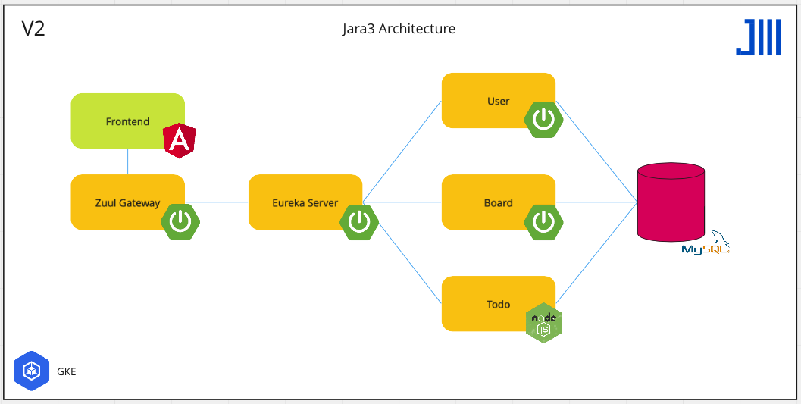

# jara3
a jira-inspired to-do list

 
 
 

### Login Page

 
 
 

### Todo Page

 
 
 

### Jara3 Architecture

 
 
 

## Useful Links:
* [User Guide](https://github.com/JRSmiffy/jara3/blob/main/docs/userguide.md)
* [Technical References](https://github.com/JRSmiffy/jara3/blob/main/docs/techref.md)
* Tools
    * [Miro](https://miro.com/app/board/uXjVOREpiSo=/)
    * [Jira](https://jrsmiffy.atlassian.net/jira/software/projects/J3/boards/1)
    * [Figma](https://www.figma.com/file/UHxgdYXdDUOoLxMO3hyzHh/Jara3)
    * [Postman](https://github.com/JRSmiffy/jara3/tree/main/docs/postman)