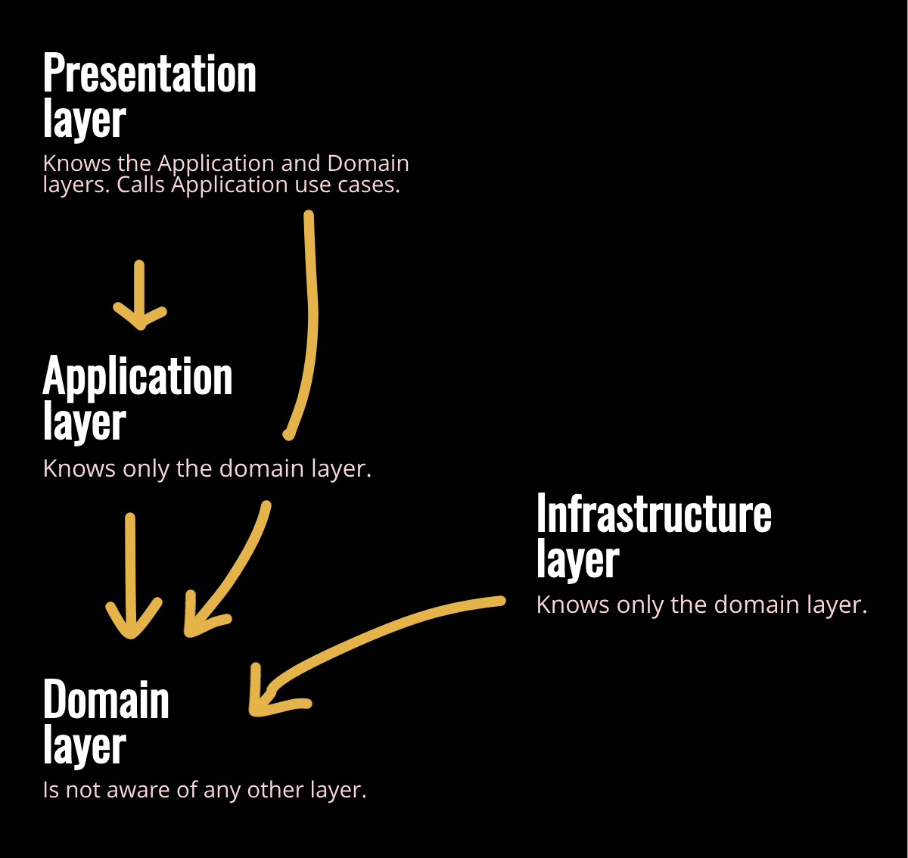
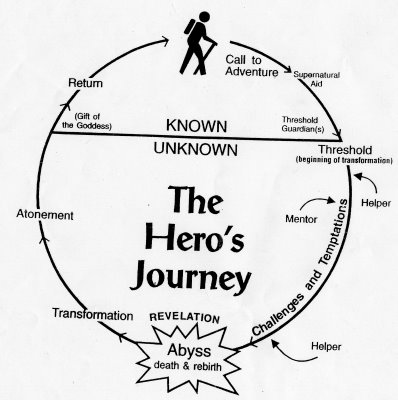

# Jara3 Technical References

<br>

## Project Tooling
* Main Development Languages
    * Java [v15](https://www.oracle.com/java/technologies/downloads/#jdk15)
    * JavaScript
* Build Tools:
    * Maven [v3.6.3](https://maven.apache.org/install.html)
    * NPM [v8.4.0](https://docs.npmjs.com/downloading-and-installing-node-js-and-npm)
* Frameworks:
    * Spring Boot [v2.6.3](https://start.spring.io)
    * Node JS [v14.15.1](https://nodejs.org/en/download/)
        * React JS [v17.0.1](https://reactjs.org/docs/create-a-new-react-app.html)
* Kubernetes Version:
    * Client:
    * Server:
* Deployment Target:
    * GKE on GCP: details...
* Container Registry:
    * DockerHub (link)
    * GCR
* Logging
    * ...
    * ...
* Testing
    * ...
    * ...

<br>

## Project Metadata
* Base Package Naming Convention
    * com.jrsmiffy.jara3

<br>

## Useful Commands
* Switch Java versions ([source](https://stackoverflow.com/questions/21964709/how-to-set-or-change-the-default-java-jdk-version-on-macos))
    * ``` /usr/libexec/java_home -V ```
    * ``` export JAVA_HOME=`/usr/libexec/java_home -v 17.0.1` ```
* Kill a service running on a particular $PORT
    * ``` lsof -nti:$PORT | xargs kill -9 ```
* Remove files that are still tracked after adding them to .gitignore ([source](https://stackoverflow.com/questions/11451535/gitignore-is-ignored-by-git))
    * ``` git rm -r --cached . ```
    * ``` git add . ```
    * ``` git commit -m "fixed untracked files" ```
* Change the port that your React app runs on ([source](https://scriptverse.academy/tutorials/reactjs-change-port-number.html))
    * ``` export PORT=8702 ```
    * ``` npm start ```

<br>

## Further Documentation
### Git Branching Strategy
* Overview
    * `master`
        * tracks production-ready state
    * `develop`
        * stages new features for deployment into production
    *  `feature` 
        * contains a stand-alone feature to be built (represents a jira-ticket)
    * `release`
        * take us from `develop` into `main` after final checks
    * `hot-fix`
        * contains a specific fix for a bug in production
* Flow
    * create a jira-ticket for a single feature or bug fix
    * checkout a `feature` branch from `develop` (feature/ticket-reference)
    * build the feature (commit often)
    * create a PR - review and merge the `feature` branch into `develop`
    * after multiple features have been staged in `develop`, checkout a `release` branch (bump version and final checks)
    * raise a PR and merge the `release` branch into `main`
    * rebase `develop` from `main`
    * delete the redundant branches, rinse and repeat
        * for `hot-fix` branches: check out from `main`, bump version & fix and then merge them into `develop` and `main`
* GitHub Actions
    * feature
        * unit tests
    * develop
        * unit tests
        * ~~deploy to dev environment~~ (single environment only)
    * main
        * unit tests
        * build images and push to registry
        * deploy to production environment

inspired by: https://nvie.com/posts/a-successful-git-branching-model/


### Jira Process
TLDR - stop using Jira as a source of documentation, instead keep a top-notch technicalreferences.md
* When working on a ticket, keep a stringent checklist of what exactly needs to be done to complete it (in the description).
* Use the comments to evidence that the work has been completed, with accompanying media (screen shots, etc).
* Stop using Jira tickets to document how to do specific tasks; you will eventually lose access to those tickets and, retrospectively, the information is hard/impossible to pull out in bulk.
    * Instead, consistently add knowledge to techincalreferences.md - build up a great bank of TINTK.
    * You can still put commands, links and details in the Jira comments (there's still some use in that). You can (and should) still keep a top-notch Jira but don't go overboard and invest the same effort into keeping personal documentation.

### Creating a React Frontend that is able to talk with Eureka
* React is a JavaScript library, not a framework. Hence the frontend application is really a Node.js application, as we needed an express server backend in order to communicate with Eureka and perform REST calls.
* During my research I came across many references to the use of Zuul as an API gateway, alongside Spring Eureka when setting up a polyglot microservices architecture for the cloud. I also came across the Netflix suggestion of using a spring boot sidecar alongside your non-JVM application when trying to register with Eureka. I also came across references to Ingress controllers and using NGINX as a reverse proxy. All of these things are new to me and maybe the official way of doing things. However I believe the solution I have gone for is sufficient and if there is a better way of doing things, I hope to learn it in the future.
* The solution I have gone for is inspired by two tutorials that I found:
    1. [Registering Node.js with Eureka](https://medium.com/@zilayhuda/register-nodejs-service-with-netflix-eureka-and-use-zuul-for-routing-service-part-1-e50fc49d1219)
        * https://github.com/zilehuda/eureka-zuul-nodejs-microservices
    2. [Packaging React inside Node.js](https://medium.com/geekculture/build-and-deploy-a-web-application-with-react-and-node-js-express-bce2c3cfec32)
        * https://github.com/leandroercoli/NodeReact
* With the first one, I pinched the ```eureka-helper.js``` file, which I then used to register the app with Eureka when Express server is created. It leaverages the [eureka-js-client](https://www.google.com/search?client=safari&rls=en&q=eureka-js-client&ie=UTF-8&oe=UTF-8).
* The second one allowed me to have a React client running inside my Node.js application that was then able to make use of the register information provided by Eureka in order to make calls to the backend micro-service (i.e the user-service).
* Steps to create the frontend:
    * ``` mkdir frontend```
    * ``` npm init -y ```
    * ``` npm install ```
    * ``` npm i express cors dotenv express-validator cross-fetch```
    * Add the ```scripts``` to ```package.json```
    * *optional*: Create .gitignore and .env 
    * Create ```/models``` with ```server.js```, ```eureka-helper.js``` and ```eureka-registry.js```
        * ```eureka-helper.js```: registers us to the Eureka server and fetches the registry containing the paths to the other services.
        * ```eureka-registry.js```: gets updated by ```eureka-helper.js``` to store and paths for the other services and exposes them to the client application through the controller.
    * Create ```app.js```
        * serves as the entry point to the application - spins us the Express server and registers us with Eureka.
    * Add the ```/controllers``` and ```/routes```
        * These controllers and routes are responsible for making the actual REST call. The flow is as follows:
            * Inside the Client React app, the a Component (such as Login) has a JS function that calls the index.js for the API's (also inside the Client).
            * The Client's ```/api/index.js``` calls the routes, which have been globally exported in the Node.js wrapper application.
            * The routes lead to the controller, which is responsible for making the actual call to Eureka, using the URL provided by ```eureka-registry.js```. It thens forwards the response back the Component that requested the call.
    * *optional*: Add ```/middleware``` for enhancing the REST call - for example, adding validation to input form
    * Create the React application (in ```/frontend```)
        * ``` npx create-react-app client ```
        * ``` cd client ```
        * ``` npm install ```
        * ``` npm install react-bootstrap bootstrap@5.1.3 ```
    * Replace ```App.js```.
    * Add the ```/src/api/index.js``` to make API calls to the Node.js controller.
    * Add the Components
* Notes:
    * How to Run: ``` node start ```
        * If you make a change to the React app, ``` npm run build ; node start ```

### Domain Driven Design
This is going to be a very brief introduction and will need to refined over time. This is not intended to be a full dive into DDD, rather an introduction so I can build a base that I can build upon over time.
* Principles:
    * DDD is a design approach that aims to make software reflect a real-world system
        * The structure and language of the code should reflect the business domain - as a crude example, a loans processing application may have classes such as LoanApplication and Customer, and methods such as AcceptOffer and Withdraw.
    * There are three core principles in DDD:
        1. Separate the concerns into layers
        2. Model the Domain
        3. Manage the life-cycle of Domain objects
    * 1 - Separate the concerns into layers
        * User Interface / Presentation Layer
            * Responible for displaying information to the user (human or another computer system) and interpreting user commands. 
            * Knows about the Application and Domain Layers only.
        * Application Layer
            * Defines the jobs that the software is to perform and coordinates the domain objects accordingly.
            * This layer is kept thin and does not contain business knowledge. It doesn't have state reflecting the business situation, only state that the reflects the progress of a task, if any state at all.
            * Knows about the Domain Layer only.
        * Domain Layer (Model Layer)
            * Contains the business logic. This layer is the heart of the software. It has state that reflects the business situation (but technical details of storing the state are delegated to the Infrastructure Layer).
            * Is not aware of any other layers.
        * Infrastructure Layer
            * Provides technical capabilities that support the higher layers: message sending, persistence for the domain and so on...
            * Know of only the Domain Layer.   
        <br>  <br><br>
    * 2 - Model the Domain
* Process:
    * this
    * that
* Good resources:
    * https://medium.com/inato/an-introduction-to-domain-driven-design-386754392465
    * https://en.wikipedia.org/wiki/Domain-driven_design

### School Periods
* Work can be loosely divided in half between ***passive*** tasks (learning/researching/documenting) and ***assertive*** tasks (designing/building/testing). 
    * I find that the designing/building tasks are very engaging and can be done for long periods without interuption. On the other hand, whilst the learning/researching tasks are essential, I find them taxing and cannot do them for long periods. 
    * "A change is as good as a rest"
        * Alternate between these types of tasks, spending 1h periods on each.
        * It is useful to switch from learning to doing when your ability to take on new information is wavering.
        * It is also useful to switch from being stuck on a particular problem and come back to it - often solutions fall out with fresh eyes.
    * Example:
        * Let's say I'm learning about Unit Testing/TDD because I've got some tests to write. I can do an hours ***learning*** and then switch to another ***doing*** task that is pending. After an hours ***doing***, I can switch back to ***learning*** and do another hours on TDD. Rinse and repeat.
        * Doesn't have to be super strict - reach a natural hiatus before stopping the task that you're on.
    * Time boxing
        * Timeboxing tasks into 1h chunks is useful not only for switching tasks and means you'll also get more work out per minute. Focus will intesify.
            * Parkinson's Law: work expands to fill the time allotted for it.
            * [Elon Musk Timeboxing](https://www.youtube.com/watch?v=fbAYK4KQrso)

### Mastery Cycle
* Micro
    * A process to improve. If you're going to spend a unit of time learning something, you should complete a full cycle of this process. 
        * Example: learning DDD.
            * Blanket introduction, aim to uncover the full landscape - DDD: discover the three core concepts of separate concerns, model domain and manage domain object lifecycle.
            * Drill down into one area at a time (isolate) and learn enough to be able to contribute something of value (perhaps cover one topic per individual session). DDD: in individual an session, cover 'separate concerns' and absorb something of use.
            * Cover each of the concepts in your scope (intergrate) and then apply them to create something - possibly very similar to what you've learnt. DDD: create a DDD design on Miro using the concepts that you've just learnt.
            * Following the rule of 80:20, whilst applying the concepts that you've learnt add 20% of your own flair to strecth yourself (improvise). Make sure that you get a mentor to review your work and provide feedback. DDD: fill in the gaps in your Miro design with your own ideas; get feedback from a mentor at work and apply it.
* Macro
    * The Ido Portal Levels of Mastery
        * Level 0: NO ABILITY
            * The "Fool"
            * You don't know what you don't know
            * Hero's jounery: Call to Adventure
            * You have no understanding of the domain and cannot do anything meaninful
        * Level 1: ISOLATION
            * The "Apprentice"
            * You know what you don't know
            * Hero's Journey: Challenges and Trials, help from Mentors
            * You are beinnging to understand the domain but are unable to contribute anything of value.
        * Level 2: INTEGRATION
            * The "Journeyman"
            * You know what you know what you know
            * Hero's Journey: Post-Revelation Transformation
            * You understand the domain well enough to contribute something of value
        * Level 3: IMPROVISATION
            * The "Redeemer"
            * You don't know what you know
            * Hero's Journey: Return with the Gift
            * You understand the domain well enough to create something new (tip of the spear)
            
             <br><br>
        * Example: studying for CKAD
            * ISOLATE: learn the concepts
            * INTEGRATE: hands on exercises
            * IMPROVISE: in-the-wild experience

### This and That
<br>

 

